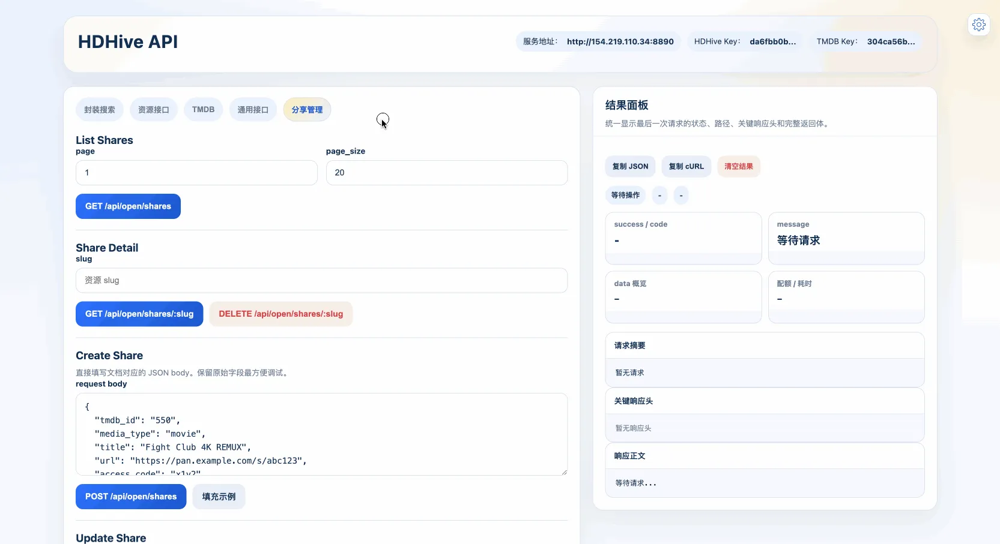

# HDHive API

独立的 HDHive Open API 测试客户端

目标：

- 直接封装 `HDHive Open API` 文档中的接口
- 对上游 JSON 响应尽量原样透传
- 独立暴露本地 HTTP API，方便先验证查询、解锁、分享管理链路
- 提供一个内置 Web 控制台，方便可视化查看配额、响应头、原始 JSON 和调试请求
- 在内置 Web 控制台里额外提供一个“封装搜索”工作流，方便先用 TMDB 搜索，再批量处理 HDHive 资源

## 界面


## 启动

在仓库根目录执行：

```bash
go run ./hdhive-api
```

或先构建：

```bash
go build -o ./bin/hdhive-test ./hdhive-api
./bin/hdhive-test
```

## 环境变量

- `HDHIVE_LISTEN_ADDR`
  默认 `:8890`
- `HDHIVE_BASE_URL`
  默认 `https://hdhive.com`
- `HDHIVE_API_KEY`
  默认空。若请求头未传 `X-API-Key`，则使用这里的默认值
- `TMDB_API_KEY`
  默认空。若请求头未传 `X-TMDB-API-Key`，则使用这里的默认值
- `TMDB_BASE_URL`
  默认 `https://api.tmdb.org`，本地服务会自动按 v3 路径拼成 `https://api.tmdb.org/3`
- `HDHIVE_TIMEOUT_SECONDS`
  默认 `20`
- `GIN_MODE`
  默认 `release`

## API 总览

本地服务默认监听 `http://localhost:8890`。

Web 控制台入口：

- [`GET /`](#get-)
  打开内置测试页面，统一操作所有已实现接口

### 本地辅助接口

- [`GET /healthz`](#get-healthz)
  本地健康检查，不请求上游

### 通用接口

- [`GET /api/open/ping`](#get-apiopenping)
  验证 API Key 是否有效
- [`GET /api/open/quota`](#get-apiopenquota)
  查询当前 API Key 配额
- [`GET /api/open/usage`](#get-apiopenusage)
  查询用量统计
- [`GET /api/open/usage/today`](#get-apiopenusagetoday)
  查询今日用量

### TMDB 接口

- [`GET /api/tmdb/configuration`](#get-apitmdbconfiguration)
  获取 TMDB 配置，例如图片基础地址
- [`GET /api/tmdb/configuration/primary_translations`](#get-apitmdbconfigurationprimary_translations)
  获取 TMDB 官方支持的 primary translation code 列表
- [`GET /api/tmdb/search/:media_type`](#get-apitmdbsearchmedia_type)
  按 `movie`、`tv` 或 `multi` 搜索 TMDB 原始结果
- [`GET /api/tmdb/:media_type/:media_id`](#get-apitmdbmedia_typemedia_id)
  获取指定 `movie` 或 `tv` 的 TMDB 原始详情

### 资源接口

- [`GET /api/open/resources/:type/:tmdb_id`](#get-apiopenresourcestypetmdb_id)
  根据媒体类型和 TMDB ID 获取资源列表
- [`POST /api/open/resources/unlock`](#post-apiopenresourcesunlock)
  解锁资源，返回链接或访问码
- [`POST /api/open/check/resource`](#post-apiopencheckresource)
  检查分享链接所属网盘类型

### 分享管理接口

- [`GET /api/open/shares`](#get-apiopenshares)
  获取我的分享列表
- [`GET /api/open/shares/:slug`](#get-apiopensharesslug)
  获取指定分享详情
- [`POST /api/open/shares`](#post-apiopenshares)
  创建分享
- [`PATCH /api/open/shares/:slug`](#patch-apiopensharesslug)
  更新分享
- [`DELETE /api/open/shares/:slug`](#delete-apiopensharesslug)
  删除分享

## 通用说明

### 认证方式

所有 `/api/open/*` 接口都需要 API Key。

优先级：

1. 请求头 `X-API-Key`
2. 环境变量 `HDHIVE_API_KEY`

请求头示例：

```http
X-API-Key: your-api-key-here
```

### 响应行为

- 所有已实现的 `/api/open/*` 接口都尽量原样透传上游响应
- 所有已实现的 `/api/tmdb/*` 接口都尽量原样透传 TMDB 原始响应
- 会保留关键响应头：
  - `Content-Type`
  - `X-RateLimit-Reset`
  - `X-Endpoint-Limit`
  - `X-Endpoint-Remaining`
  - `Retry-After`

### 内置 Web 控制台补充说明

`GET /` 返回的控制台除了原始 API 调试外，还内置了一个“封装搜索”页面，行为如下：

- 按关键词同时搜索 `movie + tv`
- 通过 TMDB 搜索结果选择具体媒体后，再调用 `GET /api/open/resources/:type/:tmdb_id`
- 默认仅自动处理当前用户可直接获取的资源
- 可选显示收费资源；收费资源默认仅展示，不会自动扣积分
- 收费资源需要用户手动逐个点击解锁
- 解锁得到的链接支持直接点击复制
- 资源解锁结果会显示 `pan_type`，并支持按网盘类型筛选免费 / 收费资源列表

该页面还做了两层本地优化：

1. 失效资源预过滤
   - 若 `GET /api/open/resources/:type/:tmdb_id` 返回的某条资源同时满足：
   - `validate_status == "invalid"`
   - 且 `validate_message` 包含 `链接无效` 或 `链接已失效`
   - 则该资源会在前端封装搜索流程中直接忽略，不再继续请求详情和解锁接口

2. 解锁结果缓存
   - 对成功解锁得到的结果按 `服务端地址 + API Key + slug` 进行本地缓存
   - 自动解锁免费资源时会优先读取缓存
   - 收费资源手动解锁时也会优先读取缓存
   - 当前缓存有效期为 24 小时
   - 缓存仅影响 `GET /` 返回的内置控制台，不会改变服务端 API 本身的返回

## 接口详情

### `GET /`

本地 Web 控制台入口，不请求上游。

功能：

- 可视化填写 API Key
- 直接测试所有已实现的 Open API 接口
- 在页面右侧查看状态码、关键响应头、原始 JSON、请求摘要和 cURL
- 提供一个封装搜索界面，串联 TMDB 搜索与 HDHive 资源处理
- 封装搜索界面支持免费/收费资源分栏查看、网盘类型筛选、分页、手动解锁和链接复制
- 封装搜索界面内置失效资源过滤与解锁缓存

请求示例：

直接在浏览器打开：

```text
http://localhost:8890/
```

返回：

- `text/html`
- 一个内置的单页测试控制台

---

### `GET /healthz`

本地健康检查接口，不请求上游。

功能：

- 用于确认测试客户端进程是否已启动
- 返回当前配置的上游地址

请求示例：

```bash
curl http://localhost:8890/healthz
```

返回示例：

```json
{
  "success": true,
  "message": "ok",
  "upstream": "https://hdhive.com/api/open"
}
```

返回字段：

| 字段 | 类型 | 说明 |
|------|------|------|
| `success` | boolean | 固定为 `true` |
| `message` | string | 固定为 `ok` |
| `upstream` | string | 当前上游 Open API 地址 |

---

### `GET /api/open/ping`

功能：

- 健康检查
- 验证 API 密钥是否有效

请求示例：

```bash
curl -H "X-API-Key: your-api-key" \
  http://localhost:8890/api/open/ping
```

成功响应：

```json
{
  "success": true,
  "code": "200",
  "message": "success",
  "data": {
    "message": "pong",
    "api_key_id": 1,
    "name": "My App"
  }
}
```

响应字段：

| 字段 | 类型 | 说明 |
|------|------|------|
| `data.message` | string | 固定返回 `pong` |
| `data.api_key_id` | integer | 当前 API Key ID |
| `data.name` | string | 当前 API Key 名称 |

---

### `GET /api/open/quota`

功能：

- 获取当前 API Key 的配额信息

请求示例：

```bash
curl -H "X-API-Key: your-api-key" \
  http://localhost:8890/api/open/quota
```

成功响应：

```json
{
  "success": true,
  "code": "200",
  "message": "success",
  "data": {
    "daily_reset": 1707494400,
    "endpoint_limit": 1000,
    "endpoint_remaining": 850
  }
}
```

响应字段：

| 字段 | 类型 | 说明 |
|------|------|------|
| `data.daily_reset` | integer | 配额重置时间（Unix 时间戳，北京时间次日 00:00） |
| `data.endpoint_limit` | integer / null | 当前接口每日配额上限 |
| `data.endpoint_remaining` | integer / null | 当前接口今日剩余配额 |

---

### `GET /api/open/usage`

功能：

- 获取当前 API Key 的用量统计
- 包含每日统计、接口统计、汇总数据

请求参数：

| 参数 | 位置 | 类型 | 必填 | 说明 |
|------|------|------|------|------|
| `start_date` | query | string | 否 | 开始日期，格式 `YYYY-MM-DD` |
| `end_date` | query | string | 否 | 结束日期，格式 `YYYY-MM-DD` |

请求示例：

```bash
curl -H "X-API-Key: your-api-key" \
  "http://localhost:8890/api/open/usage?start_date=2025-01-01&end_date=2025-01-31"
```

成功响应：

```json
{
  "success": true,
  "code": "200",
  "message": "success",
  "data": {
    "daily_stats": [
      { "date": "2025-01-01", "total_calls": 120 },
      { "date": "2025-01-02", "total_calls": 85 }
    ],
    "endpoint_stats": [
      { "endpoint": "/api/open/resources/:type/:tmdb_id", "total_calls": 150 },
      { "endpoint": "/api/open/resources/unlock", "total_calls": 55 }
    ],
    "summary": {
      "total_calls": 205,
      "success_calls": 200,
      "failed_calls": 5,
      "avg_latency": 123.45
    }
  }
}
```

响应字段：

| 字段 | 类型 | 说明 |
|------|------|------|
| `data.daily_stats` | array | 每日调用统计 |
| `data.daily_stats[].date` | string | 日期 |
| `data.daily_stats[].total_calls` | integer | 当日总调用次数 |
| `data.endpoint_stats` | array | 按接口分组统计 |
| `data.endpoint_stats[].endpoint` | string | 接口路径 |
| `data.endpoint_stats[].total_calls` | integer | 该接口总调用次数 |
| `data.summary.total_calls` | integer | 总调用次数 |
| `data.summary.success_calls` | integer | 成功调用次数 |
| `data.summary.failed_calls` | integer | 失败调用次数 |
| `data.summary.avg_latency` | number | 平均响应延迟（毫秒） |

---

### `GET /api/open/usage/today`

功能：

- 获取当前 API Key 的今日用量统计

请求示例：

```bash
curl -H "X-API-Key: your-api-key" \
  http://localhost:8890/api/open/usage/today
```

成功响应：

```json
{
  "success": true,
  "code": "200",
  "message": "success",
  "data": {
    "total_calls": 50,
    "success_calls": 48,
    "failed_calls": 2,
    "avg_latency": 98.76
  }
}
```

响应字段：

| 字段 | 类型 | 说明 |
|------|------|------|
| `data.total_calls` | integer | 今日总调用次数 |
| `data.success_calls` | integer | 今日成功调用次数 |
| `data.failed_calls` | integer | 今日失败调用次数 |
| `data.avg_latency` | number | 今日平均响应延迟（毫秒） |

---

### `GET /api/open/resources/:type/:tmdb_id`

功能：

- 根据媒体类型和 TMDB ID 获取资源列表

请求参数：

| 参数 | 位置 | 类型 | 必填 | 说明 |
|------|------|------|------|------|
| `type` | path | string | 是 | 媒体类型，可选 `movie`、`tv` |
| `tmdb_id` | path | string | 是 | TMDB ID |

请求示例：

```bash
curl -H "X-API-Key: your-api-key" \
  http://localhost:8890/api/open/resources/movie/550
```

成功响应：

```json
{
  "success": true,
  "code": "200",
  "message": "success",
  "data": [
    {
      "slug": "a1b2c3d4e5f647898765432112345678",
      "title": "Fight Club 4K REMUX",
      "share_size": "58.3 GB",
      "video_resolution": ["2160p"],
      "source": ["REMUX"],
      "subtitle_language": ["中文", "英文"],
      "subtitle_type": ["内嵌"],
      "remark": "杜比视界",
      "unlock_points": 10,
      "unlocked_users_count": 42,
      "validate_status": "valid",
      "validate_message": null,
      "last_validated_at": "2025-01-08 12:00:00",
      "is_official": true,
      "is_unlocked": false,
      "user": {
        "id": 1,
        "nickname": "HDHive",
        "avatar_url": "https://example.com/avatar.jpg"
      },
      "created_at": "2025-01-01 10:00:00"
    }
  ],
  "meta": {
    "total": 1
  }
}
```

响应字段：

| 字段 | 类型 | 说明 |
|------|------|------|
| `data[].slug` | string | 资源唯一标识 |
| `data[].title` | string / null | 资源标题 |
| `data[].share_size` | string / null | 分享文件大小 |
| `data[].video_resolution` | string[] | 视频分辨率列表 |
| `data[].source` | string[] | 来源列表 |
| `data[].subtitle_language` | string[] | 字幕语言列表 |
| `data[].subtitle_type` | string[] | 字幕类型列表 |
| `data[].remark` | string / null | 备注 |
| `data[].unlock_points` | integer / null | 解锁所需积分 |
| `data[].unlocked_users_count` | integer / null | 已解锁用户数 |
| `data[].validate_status` | string / null | 资源验证状态 |
| `data[].validate_message` | string / null | 验证信息 |
| `data[].last_validated_at` | string / null | 最后验证时间 |
| `data[].is_official` | boolean / null | 是否官方资源 |
| `data[].is_unlocked` | boolean | 当前用户是否已解锁 |
| `data[].user` | object / null | 分享者信息 |
| `data[].created_at` | string | 创建时间 |
| `meta.total` | integer | 资源总数 |

说明：

- 若对应电影/电视剧不存在，返回空列表而不是 `404`
- 对于内置 Web 控制台里的封装搜索流程，本地前端会额外忽略以下资源：
  - `validate_status == "invalid"`
  - 且 `validate_message` 包含 `链接无效` 或 `链接已失效`
- 上述过滤仅发生在 `GET /` 返回的前端工作流中；接口本身仍原样返回上游数据

---

### `GET /api/tmdb/configuration`

功能：

- 获取 TMDB 官方 `configuration` 响应
- 可用于拼接图片地址、查看图片尺寸配置

请求示例：

```bash
curl -H "X-TMDB-API-Key: your-tmdb-api-key" \
  http://localhost:8890/api/tmdb/configuration
```

说明：

- 本接口为 TMDB 官方原始响应代理
- 若未传 `X-TMDB-API-Key`，会尝试使用环境变量 `TMDB_API_KEY`

---

### `GET /api/tmdb/configuration/primary_translations`

功能：

- 获取 TMDB 官方支持的 primary translation code 列表
- 可直接用于前端语言下拉选择，例如 `zh-CN`、`en-US`、`ja-JP`

请求示例：

```bash
curl -H "X-TMDB-API-Key: your-tmdb-api-key" \
  http://localhost:8890/api/tmdb/configuration/primary_translations
```

说明：

- 本接口为 TMDB 官方原始响应代理
- 返回为字符串数组

---

### `GET /api/tmdb/search/:media_type`

功能：

- 调用 TMDB 官方搜索接口
- 支持 `movie`、`tv`、`multi`
- 适合根据关键词获取 `tmdb_id`、`poster_path`、`overview`

请求参数：

| 参数 | 位置 | 类型 | 必填 | 说明 |
|------|------|------|------|------|
| `media_type` | path | string | 是 | `movie`、`tv` 或 `multi` |
| `query` | query | string | 是 | 搜索关键词 |
| `page` | query | integer | 否 | 页码 |
| `language` | query | string | 否 | 语言，如 `zh-CN`、`en-US` |

请求示例：

```bash
curl -H "X-TMDB-API-Key: your-tmdb-api-key" \
  "http://localhost:8890/api/tmdb/search/movie?query=Fight%20Club&language=zh-CN&page=1"
```

说明：

- 本接口为 TMDB 官方原始响应代理
- 返回字段取决于 TMDB 官方当前响应

---

### `GET /api/tmdb/:media_type/:media_id`

功能：

- 获取指定电影或剧集的 TMDB 原始详情
- 可配合 `append_to_response=images` 取回海报、剧照等数据

请求参数：

| 参数 | 位置 | 类型 | 必填 | 说明 |
|------|------|------|------|------|
| `media_type` | path | string | 是 | `movie` 或 `tv` |
| `media_id` | path | string | 是 | TMDB 媒体 ID |
| `language` | query | string | 否 | 语言，如 `zh-CN` |
| `append_to_response` | query | string | 否 | 例如 `images`、`credits`、`videos` |

请求示例：

```bash
curl -H "X-TMDB-API-Key: your-tmdb-api-key" \
  "http://localhost:8890/api/tmdb/movie/550?language=zh-CN&append_to_response=images"
```

说明：

- 本接口为 TMDB 官方原始响应代理

---

### `POST /api/open/resources/unlock`

功能：

- 使用积分解锁资源
- 获取下载链接或访问码
- 本地保留安全开关，默认不允许扣积分

请求参数：

| 参数 | 位置 | 类型 | 必填 | 说明 |
|------|------|------|------|------|
| `slug` | body | string | 是 | 资源 slug |
| `allow_points` | body | boolean | 否 | 本地安全开关。默认 `false`，即默认不允许扣积分解锁 |

请求示例：

```bash
curl -X POST \
  -H "X-API-Key: your-api-key" \
  -H "Content-Type: application/json" \
  -d '{
    "slug": "a1b2c3d4e5f647898765432112345678",
    "allow_points": false
  }' \
  http://localhost:8890/api/open/resources/unlock
```

说明：

- 当 `allow_points=false` 或未传时，本地会先查询 `GET /api/open/shares/:slug`
- 若当前资源对该用户可免费获取，或已解锁，或 `actual_unlock_points <= 0`，则继续调用上游解锁
- 若当前资源需要真实扣积分，则本地直接返回 `POINTS_REQUIRED`
- 当 `allow_points=true` 时，直接透传到上游解锁接口
- `GET /` 返回的内置控制台会对成功解锁结果做本地缓存，避免重复调用该接口
- 该缓存只存在于浏览器本地存储中，不会改变服务端接口行为

成功响应：

```json
{
  "success": true,
  "code": "200",
  "message": "解锁成功",
  "data": {
    "url": "https://pan.example.com/s/abc123",
    "access_code": "x1y2",
    "full_url": "https://pan.example.com/s/abc123?pwd=x1y2",
    "already_owned": false
  }
}
```

响应字段：

| 字段 | 类型 | 说明 |
|------|------|------|
| `data.url` | string | 资源链接 |
| `data.access_code` | string | 访问码/提取码 |
| `data.full_url` | string | 完整链接（含访问码） |
| `data.already_owned` | boolean | 是否之前已解锁 |

---

### `POST /api/open/check/resource`

功能：

- 检查资源链接的网盘类型
- 在创建分享前预判网盘平台
- 自动解析 115 / 123 网盘访问码

请求参数：

| 参数 | 位置 | 类型 | 必填 | 说明 |
|------|------|------|------|------|
| `url` | body | string | 是 | 资源分享链接 |

请求示例：

```bash
curl -X POST \
  -H "X-API-Key: your-api-key" \
  -H "Content-Type: application/json" \
  -d '{"url": "https://115.com/s/abc123#xxxx 访问码:1234"}' \
  http://localhost:8890/api/open/check/resource
```

成功响应：

```json
{
  "success": true,
  "code": "200",
  "message": "success",
  "data": {
    "website": "115",
    "url": "https://115.com/s/abc123",
    "base_link": "https://115.com/s/abc123",
    "access_code": "1234",
    "default_unlock_points": 10
  }
}
```

响应字段：

| 字段 | 类型 | 说明 |
|------|------|------|
| `data.website` | string | 网盘类型，如 `115`、`123`、`quark`、`baidu`、`ed2k` |
| `data.url` | string | 提取后的干净链接 |
| `data.base_link` | string | 基础链接，仅 115 / 123 返回 |
| `data.access_code` | string | 访问码，仅 115 / 123 自动解析 |
| `data.default_unlock_points` | integer / null | 用户默认解锁积分 |

---

### `GET /api/open/shares`

功能：

- 获取当前 API Key 关联用户的分享列表

请求参数：

| 参数 | 位置 | 类型 | 必填 | 说明 |
|------|------|------|------|------|
| `page` | query | integer | 否 | 页码，默认 `1` |
| `page_size` | query | integer | 否 | 每页条数，默认 `20`，最大 `100` |

请求示例：

```bash
curl -H "X-API-Key: your-api-key" \
  "http://localhost:8890/api/open/shares?page=1&page_size=10"
```

成功响应：

```json
{
  "success": true,
  "code": "200",
  "message": "success",
  "data": [
    {
      "slug": "a1b2c3d4e5f647898765432112345678",
      "title": "Fight Club 4K REMUX",
      "share_size": "58.3 GB",
      "video_resolution": ["4K"],
      "source": ["蓝光原盘/REMUX"],
      "subtitle_language": ["简中"],
      "subtitle_type": ["内封"],
      "remark": "杜比视界",
      "unlock_points": 10,
      "unlocked_users_count": 8,
      "validate_status": "valid",
      "validate_message": null,
      "last_validated_at": "2025-01-08 12:00:00",
      "is_official": false,
      "is_unlocked": false,
      "user": {
        "id": 1,
        "nickname": "用户A",
        "avatar_url": "https://example.com/avatar.jpg"
      },
      "created_at": "2025-01-01 10:00:00"
    }
  ],
  "meta": {
    "total": 1,
    "page": 1,
    "page_size": 10
  }
}
```

响应字段：

| 字段 | 类型 | 说明 |
|------|------|------|
| `data` | array | 分享列表 |
| `meta.total` | integer | 分享总数 |
| `meta.page` | integer | 当前页码 |
| `meta.page_size` | integer | 每页条数 |

---

### `GET /api/open/shares/:slug`

功能：

- 获取指定分享详情
- 包含媒体关联和用户信息

请求参数：

| 参数 | 位置 | 类型 | 必填 | 说明 |
|------|------|------|------|------|
| `slug` | path | string | 是 | 资源 slug |

请求示例：

```bash
curl -H "X-API-Key: your-api-key" \
  http://localhost:8890/api/open/shares/a1b2c3d4e5f647898765432112345678
```

成功响应核心字段：

| 字段 | 类型 | 说明 |
|------|------|------|
| `data.slug` | string | 资源唯一标识 |
| `data.title` | string / null | 资源标题 |
| `data.pan_type` | string / null | 网盘类型 |
| `data.share_size` | string / null | 分享大小 |
| `data.video_resolution` | string[] | 分辨率列表 |
| `data.source` | string[] | 来源列表 |
| `data.subtitle_language` | string[] | 字幕语言列表 |
| `data.subtitle_type` | string[] | 字幕类型列表 |
| `data.unlock_points` | integer / null | 设定解锁积分 |
| `data.actual_unlock_points` | integer | 当前用户实际需要支付的积分 |
| `data.is_unlocked` | boolean | 当前用户是否已解锁 |
| `data.is_free_for_user` | boolean | 当前用户是否可免费获取 |
| `data.unlock_message` | string | 解锁状态描述 |
| `data.media` | object / null | 媒体关联信息 |
| `data.media.type` | string | `movie`、`tv` 或 `collection` |
| `data.media.tmdb_id` | string / null | TMDB ID |
| `data.media.title` | string / null | 媒体标题 |
| `data.user` | object / null | 分享者信息 |

说明：

- 此接口不返回真实下载链接和访问码
- 需要通过 `/api/open/resources/unlock` 才能拿到实际链接

---

### `POST /api/open/shares`

功能：

- 创建新的资源分享
- 支持通过 TMDB ID 或系统内部 ID 关联影视内容

请求参数：

| 参数 | 位置 | 类型 | 必填 | 说明 |
|------|------|------|------|------|
| `tmdb_id` | body | string | 条件必填 | TMDB ID |
| `media_type` | body | string | 条件必填 | 使用 `tmdb_id` 时必填，取值 `movie` 或 `tv` |
| `movie_id` | body | integer | 条件必填 | 系统电影 ID，与 `tmdb_id` 二选一 |
| `tv_id` | body | integer | 条件必填 | 系统电视剧 ID，与 `tmdb_id` 二选一 |
| `collection_id` | body | integer | 否 | 系统合集 ID |
| `title` | body | string | 否 | 资源标题 |
| `url` | body | string | 是 | 分享链接 |
| `share_size` | body | string | 否 | 资源大小 |
| `video_resolution` | body | string[] | 否 | 分辨率列表 |
| `source` | body | string[] | 否 | 片源列表 |
| `subtitle_language` | body | string[] | 否 | 字幕语言列表 |
| `subtitle_type` | body | string[] | 否 | 字幕类型列表 |
| `remark` | body | string | 否 | 备注 |
| `access_code` | body | string | 否 | 访问码/提取码 |
| `unlock_points` | body | integer | 否 | 解锁所需积分 |
| `is_anonymous` | body | boolean | 否 | 是否匿名分享 |
| `hide_link` | body | boolean | 否 | 是否在 Telegram 通知中隐藏原始链接 |

关联影视必填规则：

- 需提供 `tmdb_id + media_type`
- 或 `movie_id / tv_id / collection_id` 至少其一

请求示例：

```bash
curl -X POST \
  -H "X-API-Key: your-api-key" \
  -H "Content-Type: application/json" \
  -d '{
    "tmdb_id": "550",
    "media_type": "movie",
    "title": "Fight Club 4K REMUX",
    "url": "https://pan.example.com/s/abc123",
    "access_code": "x1y2",
    "share_size": "58.3 GB",
    "video_resolution": ["4K"],
    "source": ["蓝光原盘/REMUX"],
    "subtitle_language": ["简中"],
    "subtitle_type": ["内封"],
    "unlock_points": 10,
    "is_anonymous": false
  }' \
  http://localhost:8890/api/open/shares
```

成功响应：

- 返回新建分享对象，字段结构与资源列表项基本一致

---

### `PATCH /api/open/shares/:slug`

功能：

- 部分更新已有分享
- 传什么更新什么，未传字段保持不变

请求参数：

| 参数 | 位置 | 类型 | 必填 | 说明 |
|------|------|------|------|------|
| `slug` | path | string | 是 | 资源 slug |
| `title` | body | string | 否 | 资源标题 |
| `url` | body | string | 否 | 分享链接 |
| `share_size` | body | string | 否 | 资源大小 |
| `video_resolution` | body | string[] | 否 | 分辨率列表 |
| `source` | body | string[] | 否 | 片源列表 |
| `subtitle_language` | body | string[] | 否 | 字幕语言列表 |
| `subtitle_type` | body | string[] | 否 | 字幕类型列表 |
| `remark` | body | string | 否 | 备注 |
| `access_code` | body | string | 否 | 访问码 |
| `unlock_points` | body | integer | 否 | 解锁所需积分 |
| `is_anonymous` | body | boolean | 否 | 是否匿名分享 |
| `hide_link` | body | boolean | 否 | 是否隐藏链接 |
| `notify` | body | boolean | 否 | 是否发送 Telegram 通知 |

说明：

- 至少需要提供一个更新字段

请求示例：

```bash
curl -X PATCH \
  -H "X-API-Key: your-api-key" \
  -H "Content-Type: application/json" \
  -d '{
    "title": "Fight Club 4K REMUX (更新)",
    "video_resolution": ["4K", "1080P"],
    "subtitle_language": ["简中", "繁中"]
  }' \
  http://localhost:8890/api/open/shares/a1b2c3d4e5f647898765432112345678
```

成功响应：

- 返回更新后的分享对象

---

### `DELETE /api/open/shares/:slug`

功能：

- 删除分享资源

请求参数：

| 参数 | 位置 | 类型 | 必填 | 说明 |
|------|------|------|------|------|
| `slug` | path | string | 是 | 资源 slug |

请求示例：

```bash
curl -X DELETE \
  -H "X-API-Key: your-api-key" \
  http://localhost:8890/api/open/shares/a1b2c3d4e5f647898765432112345678
```

成功响应：

```json
{
  "success": true,
  "code": "200",
  "message": "删除成功",
  "data": null
}
```

---

## 错误码说明

常见上游错误码：

| 错误码 | HTTP 状态码 | 说明 |
|--------|-------------|------|
| `MISSING_API_KEY` | 401 | 缺少 API Key |
| `INVALID_API_KEY` | 401 | API Key 无效 |
| `DISABLED_API_KEY` | 401 | API Key 已被禁用 |
| `EXPIRED_API_KEY` | 401 | API Key 已过期 |
| `ENDPOINT_DISABLED` | 403 | 接口已禁用 |
| `ENDPOINT_QUOTA_EXCEEDED` | 429 | 接口配额已用尽 |
| `RATE_LIMIT_EXCEEDED` | 429 | 请求频率过高 |
| `INSUFFICIENT_POINTS` | 402 | 积分不足 |

本地附加错误码：

| 错误码 | HTTP 状态码 | 说明 |
|--------|-------------|------|
| `UPSTREAM_REQUEST_FAILED` | 502 | 请求上游失败 |
| `UPSTREAM_RESPONSE_INVALID` | 502 | 上游返回结构无法解析 |
| `POINTS_REQUIRED` | 409 | 资源需要积分，但本地安全开关未允许扣积分 |
| `MISSING_TMDB_API_KEY` | 401 | 缺少 TMDB API Key |
| `TMDB_REQUEST_FAILED` | 502 | 请求 TMDB 失败 |

## 说明

- 如果请求头里传了 `X-API-Key`，优先使用请求头
- 如果请求头没传，则尝试使用环境变量 `HDHIVE_API_KEY`
- 默认控制台访问地址通常为 `http://127.0.0.1:8890/` 或 `http://localhost:8890/`
